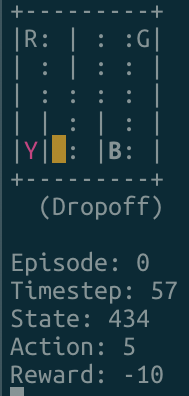

# Taxi Q-Learning

An implementation of Q-Learning using python and gym.

## Motivation

Created so that others can see how simple machine learning can be with the correctly library setup.

## Screenshots

## Tech/framework used

Built with:

- [Python](https://www.python.org/)
- [Docker](https://www.docker.com/)
- [Gym](https://gym.openai.com/)

## Features

Dockerised for use across multiple machines and environments.

## How to use?

Simple run `make play_taxi`

## Contribute

Feel free to make a pull request if you would like to add something.

## Credits

Followed [this](https://www.learndatasci.com/tutorials/reinforcement-q-learning-scratch-python-openai-gym/) guide for inspiration around the implementation of Q-Learning

## License

MIT © Joshua-Luke Bevan
